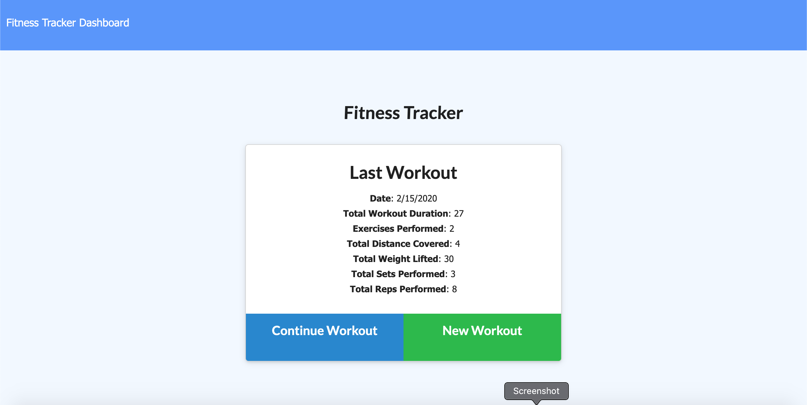
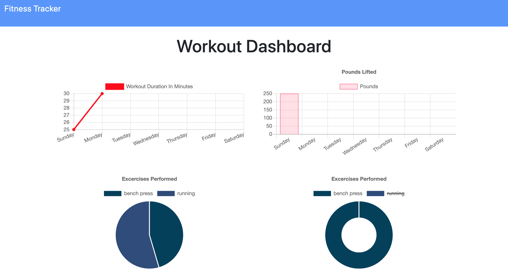

## User Story

As a user, I want to be able to view create and track daily workouts. I want to be able to log multiple exercises in a workout on a given day. I should also be able to track the name, type, weight, sets, reps, and duration of exercise. If the exercise is a cardio exercise, I should be able to track my distance traveled.

## Business Context

A consumer will reach their fitness goals quicker when they track their workout progress.

## Deployed Link
https://fitness-tea.herokuapp.com

https://fitness-tea.herokuapp.com

## Screenshot

## Author

Samantha Sengsouvanh

## License

This project is licensed under the MIT License - see the LICENSE.md file for details